## Introduction

This document covers my hands-on setup of RamaLama as part of the
Outreachy Fedora project. It walks through installation, version
verification, pulling and running two models using different
transports, and a comparison of the results. It also includes my
take on whether RamaLama lives up to its reputation for making AI
work boringly simple.

Each section includes the exact commands used, the full output, and
the reasoning behind each choice made along the way

## System Environment

**OS:** Windows 11 with WSL2 (Ubuntu 24.04 LTS)

**Container Engine:** Podman 4.9.3

**Python:** 3.12.3

**GPU:** CPU-only

**Available Disk:** 955GB free

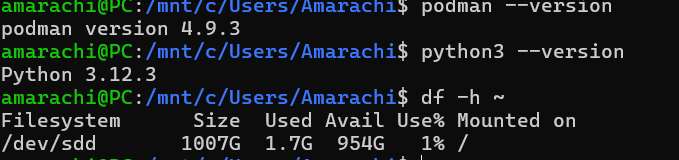

## Step 1: Installation

I started with the official install script:

```bash
curl -fsSL https://ramalama.ai/install.sh | bash
```

It printed "everything's installed!" but then threw `uv: command not
found`. The install itself worked but the PATH just wasn't updated yet.
I tried `source $HOME/.local/bin/env` and updating `.bashrc` but
`ramalama version` still came back as not found. This seems to be a
WSL2 quirk where PATH changes don't always apply cleanly.

I switched to pip:

```bash
pip install ramalama --break-system-packages
```

The `--break-system-packages` flag is needed on Ubuntu 24.04 because
the system blocks global pip installs by default. This worked and
installed ramalama 0.18.0.

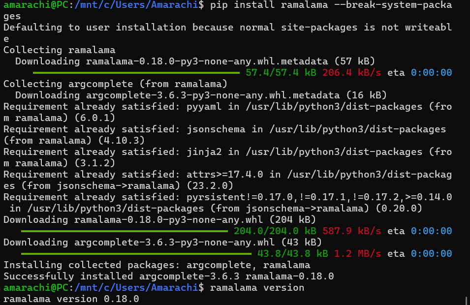

For the container engine I chose Podman over Docker because it runs
rootlessly inside WSL2 without needing Docker Desktop open in the
background. Installing it was straightforward once I used Ubuntu's
own package manager instead of a third-party repo:

```bash
sudo apt-get install -y podman
```

## Step 2: Verifying the Installation

```bash
ramalama version
```

**Output:**

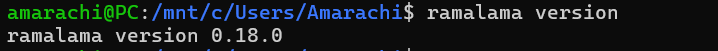

```bash
ramalama info
```

Key things RamaLama detected automatically:

- No GPU detected, selected CPU runtime
- Container engine: Podman 4.9.3
- Runtime image: quay.io/ramalama/ramalama:0.18
- Default runtime: llama.cpp

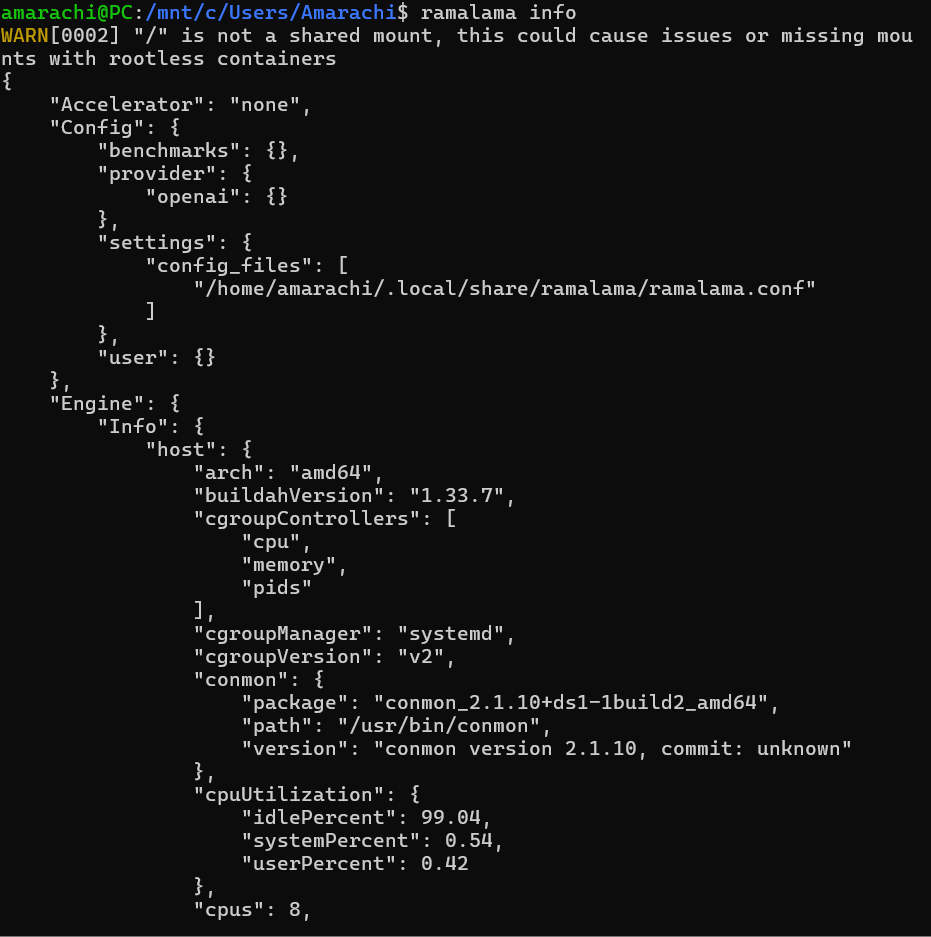

No configuration was needed on my end. RamaLama inspected the system
and made the right choices itself.

## Step 3: Pulling Model 1 - TinyLlama via Shortname

```bash
ramalama pull tinyllama
```

RamaLama resolved the shortname automatically to
`hf://TheBloke/TinyLlama-1.1B-Chat-v1.0-GGUF` and downloaded it
from HuggingFace.


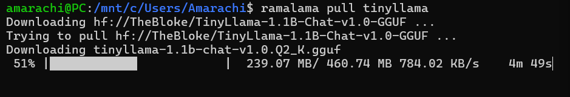
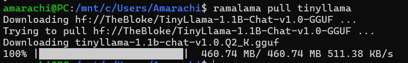

**Transport:** HuggingFace (via built-in shortname)
**Size:** 460.74 MB, small enough for CPU-only use

I picked TinyLlama because it is well known, lightweight, and a
safe starting point for a CPU-only machine.

## Step 4: Running Model 1

On first run, RamaLama silently pulled the inference runtime container
(`quay.io/ramalama/ramalama:0.18`) before starting the model. This
took a few minutes but only happens once.

```bash
ramalama run tinyllama "What are the Four Foundations of the Fedora project?"
```

**Output:**
```
The Four Foundation is the name given by the Fedora project to the
four components that make up the project:

1. Fedora: The project's official name and short form of the Fedora
   operating system.
2. Fedora Core: A collection of software modules that provide a
   minimal set of tools and services for users.
3. Fedora Community: The Fedora community is a community of
   developers, volunteers, and users who work together to improve
   the Fedora operating system.
4. Fedora Education: A project that aims to bring the Fedora
   operating system to schools and other institutions.
```

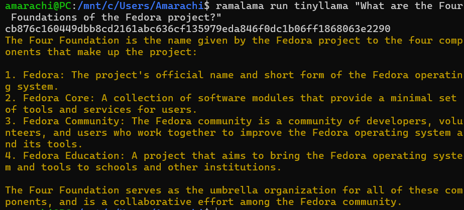

The correct answer is **Freedom, Friends, Features, and First**.
TinyLlama got none of them right. It invented four plausible-sounding
but completely wrong components. The response was structured and
confident, which made the hallucination harder to spot at first.

## Step 5: Pulling Model 2 - SmolLM2 via Explicit Transport

This time I used the full `huggingface://` prefix to make the
transport choice explicit:

```bash
ramalama pull huggingface://bartowski/SmolLM2-135M-Instruct-GGUF
```

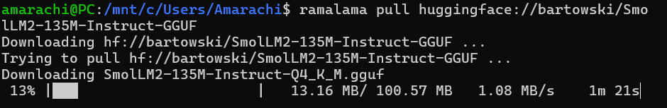
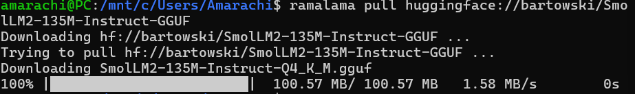

**Transport:** HuggingFace (explicit prefix)
**Size:** 100.57 MB
**Speed:** 1.58 MB/s, noticeably faster than TinyLlama's pull

SmolLM2 at 135M parameters is less than a quarter the size of
TinyLlama. I wanted to see if the smaller size affected answer
quality in any meaningful way.

## Step 6: Running Model 2

```bash
ramalama run huggingface://bartowski/SmolLM2-135M-Instruct-GGUF \
  "What are the Four Foundations of the Fedora project?"
```

**Output:**
```
The Four Foundations of the Fedora project are:

1. Foundation 1: A comprehensive open-source implementation of the
   Fedora kernel and core components.
2. Foundation 2: An extension of Foundation 1 with additional features.
3. Foundation 3: A community-driven project maintained by the Fedora
   community.
4. Foundation 4: A community-driven project maintained by the Fedora
   project team.
```

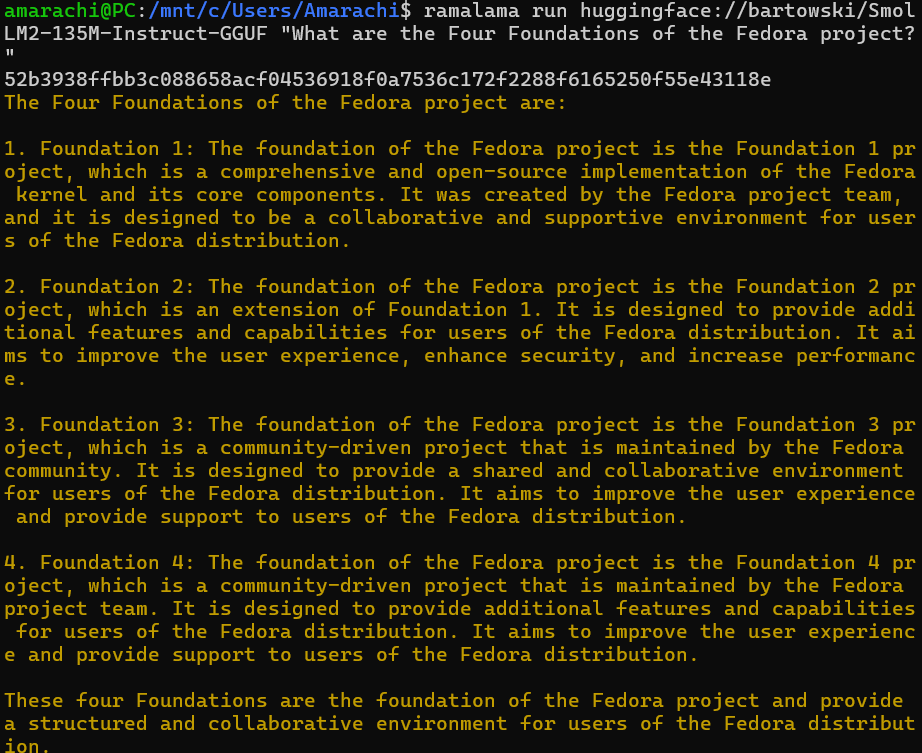

**Model Comparison:**

| | TinyLlama | SmolLM2-135M |
|---|---|---|
| Transport | HuggingFace shortname | HuggingFace explicit prefix |
| Size | 460.74 MB | 100.57 MB |
| Download speed | 511 KB/s | 1.58 MB/s |
| Accuracy | Wrong | Wrong |
| Hallucination style | Invented realistic names | Numbered placeholders |
| Response quality | Sounded plausible | Obviously made up |

Both models failed. TinyLlama at least produced names that sounded
like they could belong to a real project. SmolLM2 essentially just
numbered four empty descriptions. Neither came close to Freedom,
Friends, Features, First.

This is actually the most useful finding from the whole exercise.
These models do not have reliable knowledge of Fedora-specific facts.
They need external context, which is exactly what RAG provides.
Without it, even a confident-sounding answer cannot be trusted.

## Step 7: Additional Commands

```bash
ramalama list
```

```
NAME                                          MODIFIED        SIZE
hf://bartowski/SmolLM2-135M-Instruct-GGUF    3 minutes ago   100.57 MB
hf://TheBloke/TinyLlama-1.1B-Chat-v1.0-GGUF  40 minutes ago  460.74 MB
```

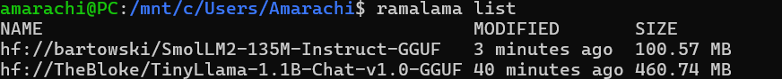

Both models sit in local storage and can be reused without
re-downloading, similar to how Podman handles container images.

```bash
ramalama inspect tinyllama
```

```
TinyLlama-1.1B-Chat-v1.0-GGUF
   Registry: huggingface
   Format: GGUF
   Version: 3
   Tensors: 201 entries
```

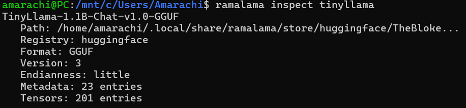

```bash
ramalama containers
```

```
CONTAINER ID  IMAGE  COMMAND  CREATED  STATUS  PORTS  NAMES
```

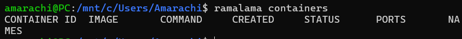

Empty. The container was automatically cleaned up after the run
finished. Nothing left running in the background.

## Does RamaLama Make AI Boring?

Honestly, yes, and I mean that positively.

Before tools like this, running a local model meant picking a
backend, installing the right GPU libraries, getting the model in
the right format, and figuring out how to manage the process. Most
of that has nothing to do with what you actually want to do with
the model.

RamaLama cuts it down to:

```bash
ramalama pull <model>
ramalama run <model> "your prompt"
```


My setup was not completely smooth though. The install script had
a PATH issue on WSL2, Podman needed some fixing before it would
install, and the first model run sat silently for several minutes
while the runtime container downloaded with no progress shown.
These are real rough edges worth knowing about.

But once past all that, the workflow was consistent every time.

## Conclusion

The setup took some troubleshooting but the actual workflow of pull,
run, get a response, was simple and repeatable. Both models
hallucinated on the Fedora question, which is not a surprise for
small models without any domain context. It is also exactly the
problem the RAG project is trying to solve.

## References

- [RamaLama GitHub](https://github.com/containers/ramalama)
- [RamaLama Documentation](https://ramalama.ai)
- [Fedora Four Foundations](https://docs.fedoraproject.org/en-US/project/)
- [HuggingFace](https://huggingface.co)